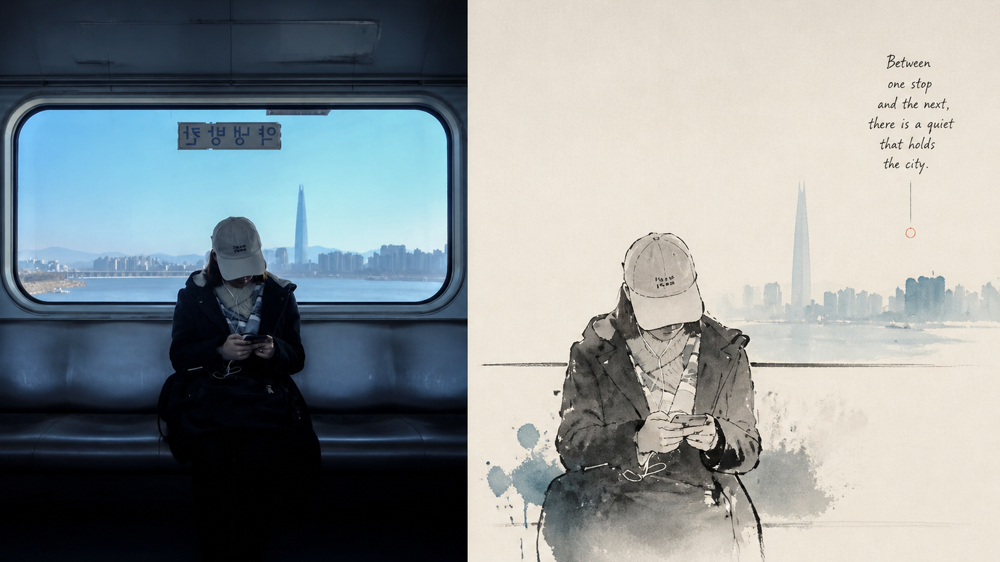
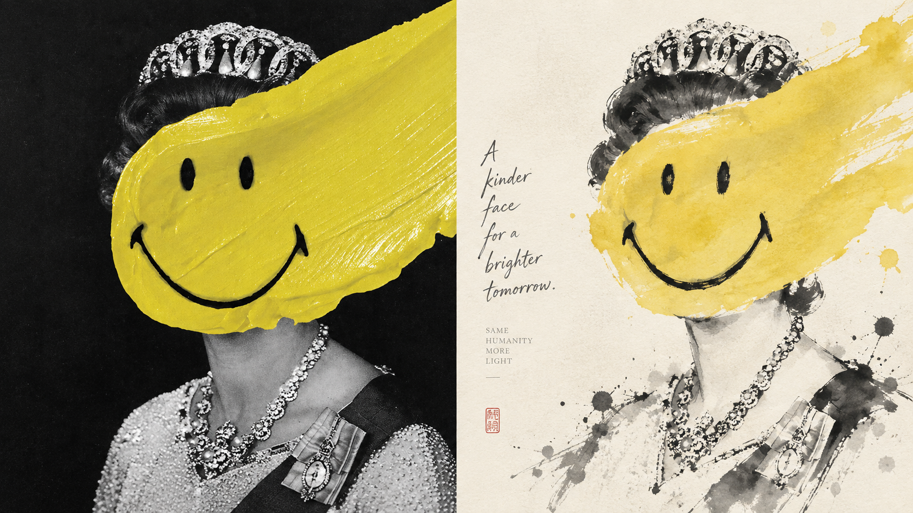
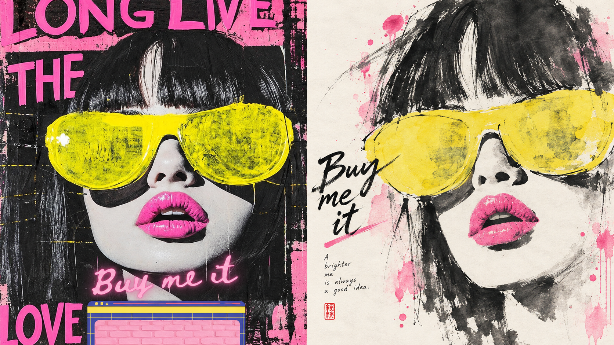
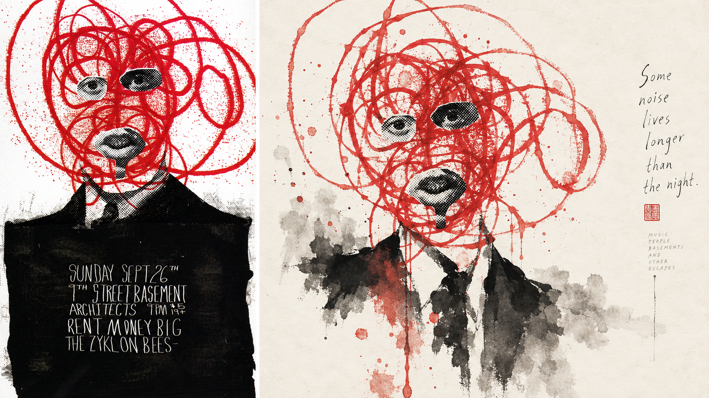
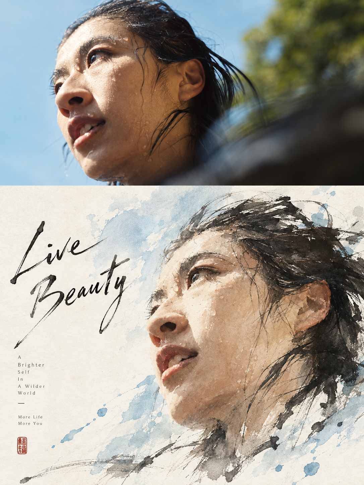
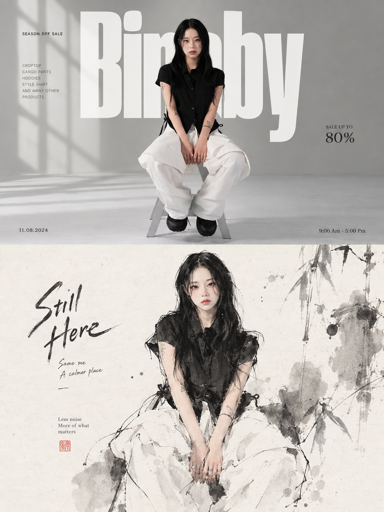
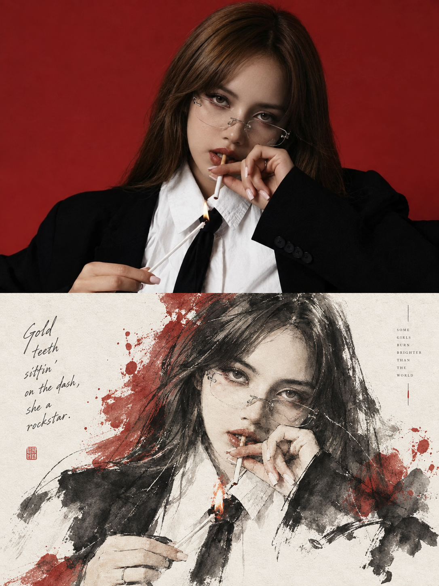

# 🦁 XXD Panel 068

### أعد عرض الصورة بالمساحة الفارغة وخطوط الحبر والألوان الفاتحة للفرشاة الشرقية اليدوية

<a href="README.md">简体中文</a> · <a href="README.en.md">English</a> · <a href="README.ja.md">日本語</a> · <a href="README.ko.md">한국어</a> · <a href="README.ar.md">العربية</a>

يعتمد Panel 068 على موقع العمل، وحساب اللونين الأبيض والأسود، والتفاعل بين الافتراضي والحقيقي، وتجميع الكثافة وتوزيعها. ويستخدم خطوط حبر بضربات مختلفة، وألوان فاتحة مقيدة، وترتيب تحرير حديث للاحتفاظ بهوية الموضوع ومذاقه، بدلاً من نسخ قالب الرسم الصيني التقليدي.

**الكلمات الرئيسية:** فرشاة شرقية يدوية · استخدام اللون الأبيض كالأسود · خط الحبر واللون الفاتح · تنضيد العنوان والملحق · ترتيب التحرير الحديث

## الاستخدام

```text
/xxd-panel-068 photo.jpg --mode design-only --size 3:4 --text prompt --locale ar-SA
```

يدعم صورة واحدة، دفعة دليل، أربعة أوضاع إخراج، أحجام متعددة وثلاثة أوضاع نصية. راجع [SKILL.md](SKILL.md) لمعرفة السلوك الكامل.

## الموجّه الأصلي · خمس لغات

[افتح الكتالوج الموحد متعدد اللغات](references/original-prompt/): [الصينية المبسطة الأصلية](references/original-prompt/zh-CN.md) · [الإنجليزية](references/original-prompt/en.md) · [اليابانية](references/original-prompt/ja.md) · [한국어](references/original-prompt/ko.md) · [العربية](references/original-prompt/ar.md)

يحفظ الملف الصيني المبسط النص الأصلي الحرفي الذي قدمه المستخدم، وهو المرجع الإبداعي والجمالي الوحيد في وقت التشغيل؛ الإصدارات الأربعة الأخرى عبارة عن ترجمات قراءة صادقة، والتي يسهل على القراء الدوليين فهمها وإعادة توجيهها، ولن تقوم بدورها بإعادة كتابة الكلمات السريعة للصور.

لا تتوفر حاليًا أي أدلة X أو مصدر أصلي، وبالتالي يتم الاحتفاظ بـ `sample-01`–`04`. تحتوي جميع العينات المضافة حديثًا أدناه على تعيين واضح لمصدر المحتوى، راجع [قائمة العينات](assets/examples/README.md) للحصول على التفاصيل.

## تمت إضافة البراهين المزدوجة 16:9 لليسار واليمين

| | |
|---|---|
|  |  |
|  |  |

## تمت إضافة البراهين المزدوجة العلوية والسفلية بنسبة 3:4

| | |
|---|---|
|  |  |
|  |  |
